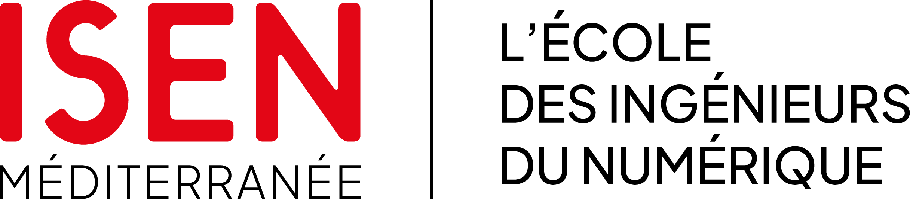
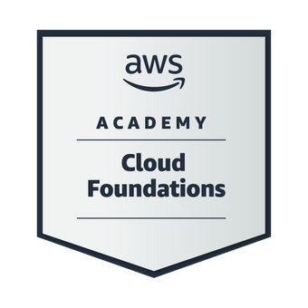

<h1 align="center">Adam Louhichi</h1>

  <strong>Ingénieur en informatique | IA • Data • Développement logiciel</strong>

  
  &nbsp;
  
  &nbsp;
  

  <strong>Toulon, France</strong>
  &nbsp; • &nbsp;
  Recherche un stage de 4 à 6 mois dès février 2027

 

<!-- ========================================================= -->

<!-- FORMATION -->

<!-- ========================================================= -->

<h2 align="center">Formation</h2>

<table align="center" width="90%">
<tr>

<td align="center" width="50%">

  

<strong>MSc Intelligent Systems & Cloud Engineering</strong>

 
ISEN Méditerranée — Toulon

 
2026 – 2027

</td>

<td align="center" width="50%">

  

<strong>Diplôme d'Ingénieur en Informatique</strong>

 
ESPRIT — Option IA & Data

 
2021 – 2026

</td>

</tr>
</table>

 

<!-- ========================================================= -->

<!-- CERTIFICATIONS -->

<!-- ========================================================= -->

<h2 align="center">Certifications</h2>

<table align="center" width="90%">
<tr>

<td align="center" width="25%">

  

<strong>AWS Certified AI Practitioner</strong>

 
Amazon Web Services

</td>

<td align="center" width="25%">

  

<strong>AWS Academy Cloud Foundations</strong>

 
Amazon Web Services

</td>

<td align="center" width="25%">

  

<strong>Fundamentals of Deep Learning</strong>

 
NVIDIA Deep Learning Institute

</td>

<td align="center" width="25%">

  

<strong>CCNA – Switching & Routing</strong>

 
Cisco Networking Academy

</td>

</tr>
</table>

  <strong>Scrum Fundamentals (SFC)</strong>

 

<!-- ========================================================= -->

<!-- LANGUES -->

<!-- ========================================================= -->

<h2 align="center">Langues</h2>

  
  &nbsp;
  
  &nbsp;
  

 

<!-- ========================================================= -->

<!-- COMPETENCES -->

<!-- ========================================================= -->

<h2 align="center">Compétences</h2>

<table align="center" width="92%">
<tr>

<td width="50%" valign="top">

<h3 align="center">Développement</h3>

</td>

<td width="50%" valign="top">

<h3 align="center">Data & Machine Learning</h3>

</td>

</tr>

<tr>

<td width="50%" valign="top">

<h3 align="center">IA générative & LLM</h3>

</td>

<td width="50%" valign="top">

<h3 align="center">Cloud & DevOps</h3>

</td>

</tr>
</table>

 

<!-- ========================================================= -->

<!-- EXPERIENCES -->

<!-- ========================================================= -->

<h2 align="center">Expériences professionnelles</h2>

<table width="92%" align="center">

<tr>
<td width="23%" valign="top">

<strong>Ministère de la Santé</strong>

 
Tunisie

  

<strong>Stagiaire PFE Ingénieur IA</strong>

  

Janvier – Juillet 2026

</td>

<td width="77%" valign="top">

<strong>Solution IA pour la gestion administrative des projets</strong>

  

Facilitation de l’accès aux informations projet et documentaires grâce à une solution IA intégrée à OpenProject et structurée autour de deux assistants conversationnels.

<ul>
<li>Conçu et développé un pipeline RAG documentaire atteignant un Recall de 0,96 et une Answer Correctness de 0,94, avec recherche vectorielle, filtrage des accès, HyDE, reranking et validation des sources.</li>
<li>Développé un agent LangGraph pour consulter et modifier les données OpenProject via l’API, avec contrôle des permissions et validation utilisateur avant exécution.</li>
<li>Déployé la solution sur l’infrastructure du Ministère et géré l’infrastructure LLM avec vLLM en inférence locale pour garantir la souveraineté des données.</li>
</ul>

</td>
</tr>

<tr>
<td width="23%" valign="top">

<strong>DataMed Consulting</strong>

 
Tunisie

  

<strong>Stagiaire IA & Développement</strong>

  

Mai – Juillet 2025

</td>

<td width="77%" valign="top">

<strong>API IA pour l’analyse et le matching de CV</strong>

  

<ul>
<li>Contribué au développement d’API IA avec FastAPI pour l’analyse, le matching et le scoring de CV/offres afin d’accélérer le processus de recrutement.</li>
<li>Réduit de 50 % le temps de traitement et de 35 % l’utilisation des tokens grâce au batching, au prompt engineering et à l’optimisation du contexte LLM.</li>
<li>Contribué au développement du frontend avec React et à son intégration avec les API de traitement et de scoring.</li>
</ul>

</td>
</tr>

<tr>
<td width="23%" valign="top">

<strong>Huawei</strong>

 
Tunisie

  

<strong>Stagiaire Développement & Data</strong>

  

Juin – Août 2024

</td>

<td width="77%" valign="top">

<strong>Automatisation du suivi et du reporting des tickets d’infrastructure</strong>

  

<ul>
<li>Automatisé la collecte et la structuration des informations de tickets à partir des e-mails des équipes infrastructure, en développant un module Java/IMAP pour extraire les données pertinentes et les alimenter dans une base SQL.</li>
<li>Facilité le suivi et le reporting des tickets d’infrastructure grâce aux données centralisées dans un dashboard Power BI présentant les incidents et leurs principaux KPI.</li>
</ul>

</td>
</tr>

</table>

 

<!-- ========================================================= -->

<!-- PROJECTS -->

<!-- ========================================================= -->

<h2 align="center">Projets académiques</h2>

<table width="92%" align="center">

<tr>
<td width="50%" valign="top">

<h3>HireBridge — Plateforme de recrutement intégrant l’IA</h3>

<strong>Django • LangChain • LangGraph • FastAPI • Amazon Lex • MongoDB</strong>

Plateforme de recrutement full-stack destinée aux candidats et recruteurs, intégrant plusieurs fonctionnalités d’intelligence artificielle.

<ul>
<li>Recommandation d’offres basée sur le profil et les compétences.</li>
<li>Chatbot de préparation aux entretiens utilisant le RAG et la recherche web.</li>
<li>Évaluation et recherche de candidats pour les recruteurs.</li>
<li>Agent vocal de suivi des candidats avec Amazon Lex et TTS/STT.</li>
</ul>

</td>

<td width="50%" valign="top">

<h3>AI Football Scouting Platform</h3>

<strong>Projet académique en collaboration avec LinkUp Sport via ESPRIT</strong>

Solution de scouting basée sur les données permettant d’exploiter les statistiques de joueurs et de produire des indicateurs utiles à l’analyse sportive.

<ul>
<li>Modèles supervisés XGBoost, Random Forest, GBM et réseaux de neurones.</li>
<li>Plus de 30 000 données collectées depuis Transfermarkt et SofaScore.</li>
<li>Plateforme web avec React et Supabase.</li>
</ul>

</td>
</tr>

<tr>
<td width="50%" valign="top">

<h3>Prédiction du churn client — Télécom</h3>

<strong>Python • Scikit-learn • Flask</strong>

Solution de machine learning destinée à prédire le risque de churn client dans le secteur des télécommunications.

<ul>
<li>Modèle Random Forest atteignant 95 % de précision.</li>
<li>Feature engineering basé sur des caractéristiques socio-économiques.</li>
<li>Grid Search et SMOTE pour l’optimisation et le traitement du déséquilibre des classes.</li>
<li>API Flask et interface web pour les prédictions en temps réel.</li>
</ul>

</td>

<td width="50%" valign="top">

<h3>Weather Forecasting with Deep Learning</h3>

<strong>TensorFlow • Keras • RNN • LSTM • Flask</strong>

Étude comparative de différentes architectures de réseaux de neurones pour la prévision de températures à partir de séries temporelles météorologiques.

<ul>
<li>Comparaison d’un Simple RNN, d’un LSTM univarié et d’un LSTM empilé multivarié.</li>
<li>MAE de test : 2,8 °C, 1,9 °C et 1,2 °C.</li>
<li>Analyse de l’impact des architectures et des variables météorologiques.</li>
</ul>

</td>
</tr>

<tr>
<td width="50%" valign="top">

<h3>Classification des maladies pulmonaires</h3>

<strong>Deep Learning • CNN • TensorFlow • Keras • Flask</strong>

Système de classification d’images médicales destiné à identifier différentes pathologies pulmonaires à partir de données d’imagerie.

<ul>
<li>Modèle CNN atteignant 94,9 % de précision.</li>
<li>Preprocessing et augmentation des données.</li>
<li>Déploiement avec Flask et interface web.</li>
</ul>

</td>

<td width="50%" valign="top">

<h3>Écosystème Web & Desktop</h3>

<strong>Symfony 5 • Java • JavaFX • SQL</strong>

Écosystème composé d’une application web Symfony 5 et d’une application desktop JavaFX partageant une même base de données.

 

</td>
</tr>

<tr>

<td width="50%" valign="top">

<h3>Suivi des visites techniques</h3>

<strong>C++ • Qt • SQL</strong>

Application desktop permettant de collecter, gérer et visualiser les informations relatives aux visites techniques à partir d’une base de données SQL.

</td>

<td width="50%" valign="top">
</td>

</tr>

</table>

 

  <strong>Merci de votre visite.</strong>

  <a href="https://www.linkedin.com/in/adam-louhichi1/">LinkedIn</a>
  &nbsp;•&nbsp;
  <a href="mailto:adamlouhichi3@gmail.com">Email</a>

